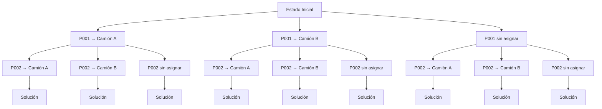

# Sistema de Gestión y Asignación de Paquetes

## Descripción

Este proyecto fue desarrollado como trabajo práctico de la materia y tiene como objetivo resolver distintos problemas relacionados con la gestión logística de paquetes y camiones de reparto.

La aplicación se divide en dos etapas principales:

1. **Servicios de consulta sobre paquetes**, priorizando la eficiencia mediante el uso de estructuras de datos adecuadas.
2. **Asignación de paquetes a camiones**, implementando y comparando dos técnicas algorítmicas clásicas: **Backtracking** y **Greedy**.

---

## Datos de entrada

La información utilizada por el sistema se carga desde dos archivos CSV:

### Camiones.csv

```text
<camiones_totales>
<id_camion>;<patente>;<esta_refrigerado>;<capacidad_kg>
```

### Paquetes.csv

```text
<paquetes_totales>
<id_paquete>;<codigo_paquete>;<peso_kg>;<contiene_alimentos>;<nivel_urgencia>
```

### Ejemplo

**Camiones.csv**

```text
3
100;AAA000A;1;100
101;AAA001B;0;500
102;AAA002C;1;115
```

**Paquetes.csv**

```text
4
1;P001;30;1;80
2;P002;100;0;2
3;P003;80;0;10
4;P004;25;1;100
```

---

## Primera Parte: Servicios de Consulta

Se implementan tres servicios sobre la colección de paquetes:

### Servicio 1

Búsqueda de un paquete a partir de su código identificador.

```java
Paquete servicio1(String codigoPaquete)
```

### Servicio 2

Obtención de todos los paquetes que contienen o no contienen alimentos.

```java
List<Paquete> servicio2(boolean contieneAlimentos)
```

### Servicio 3

Obtención de todos los paquetes cuyo nivel de urgencia se encuentre dentro de un rango determinado.

```java
List<Paquete> servicio3(int urgenciaMinima, int urgenciaMaxima)
```

Para cada servicio se analizaron e informaron las complejidades temporales, justificando las estructuras de datos seleccionadas.

---

## Segunda Parte: Asignación de Paquetes

El problema consiste en asignar todos los paquetes posibles a los camiones disponibles minimizando el peso total de los paquetes que quedan sin transportar.

### Restricciones

* Ningún camión puede superar su capacidad máxima de carga.
* Los paquetes que contienen alimentos únicamente pueden ser transportados por camiones refrigerados.

---

## Algoritmos Implementados

### Backtracking

Explora sistemáticamente el espacio de soluciones posibles generando distintos estados y descartando aquellos que violan las restricciones. Permite obtener la mejor solución encontrada respecto al peso no asignado.

#### Espacio de búsqueda

Cada nodo representa un estado parcial de la asignación.

Las ramas representan las decisiones posibles para cada paquete:

- Asignarlo a un camión válido.
- Dejarlo sin asignar.

Las hojas corresponden a soluciones completas evaluadas por el algoritmo.



**Métrica utilizada:**

- Cantidad de estados generados.
### Greedy

Construye una solución de manera incremental tomando decisiones locales según un criterio de selección previamente definido.

**Métrica utilizada:**

* Cantidad de candidatos considerados.

---

## Resultados

Para cada algoritmo se informa:

* Asignación de paquetes por camión.
* Peso total no asignado.
* Métrica de costo computacional correspondiente.
* Estrategia utilizada para la construcción de la solución.

---

## Objetivos Académicos

Este trabajo permite aplicar conceptos fundamentales de:

* Diseño de estructuras de datos.
* Análisis de complejidad temporal.
* Algoritmos de búsqueda.
* Técnicas de optimización.
* Backtracking.
* Estrategias Greedy.
* Comparación de calidad y costo de soluciones algorítmicas.

---

## Tecnologías

* Java
* Collections Framework (HashMap, ArrayList, TreeMap, etc.)
* Programación Orientada a Objetos

---

